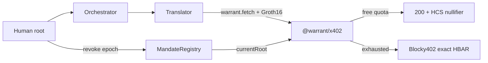

# Warrant

Zero-knowledge chains of custody for AI agents.

A human delegates authority to an agent; that agent may delegate a narrower mandate to a sub-agent. The leaf agent proves to an API, contract, or peer that it acts under a real, unique human — within scope, within budget, and not revoked — without revealing who the human is or which agents sit in the chain. Verification is a constant-size proof, checked by an `x402` server or on-chain. Revoking the root invalidates the entire tree.

Existing agent-delegation systems (IETF AIP/Biscuit, MetaMask ERC-7710, World AgentKit, Agent Passport) expose the chain. PSE’s May 2026 *ACTA* proposal lists privacy-preserving recursive delegation as an open problem. Warrant addresses that gap with Semaphore-class ZK (EdDSA-Poseidon over Baby Jubjub, Groth16), World ID AgentBook roots (or documented `tier=0` demo), and x402 settlement on Hedera via Blocky402.

| | Chain private? | Recursive attenuation | Personhood root | Revoke cascade |
|---|---|---|---|---|
| IETF AIP / Biscuit | No | Yes | No | App-defined |
| ERC-7710 | No | Yes | No | Per-session |
| World AgentKit | Human ID only | No (policy, not OBO chain) | AgentBook | N/A |
| Agent Passport (APS) | No (JWT chain) | Scoped hops | World ID | App-defined |
| **Warrant** | **Yes (ZK)** | **Yes (in-circuit)** | **AgentBook / tier** | **On-chain epoch** |

## Status

| WP | Deliverable | State |
|---|---|---|
| 0–2 | Monorepo, lean + full circuits, Groth16 verifier | Done |
| 3–4 | `MandateRegistry`, `WarrantGate`, `@warrant/core` | Done |
| 5 | `@warrant/x402` + translate service | Done |
| 6 | Agent CLI + two-agent demo + HCS | Done |
| 7 | Dashboard (Astryx + Carbon g10/g100) + revoke | Done |
| 8 | ENSv2 namespaces | **Skipped** (solo path) |
| 9 | Runnable README + partner feedback | Done |
| 10 | End-to-end definition of done | Done (`pnpm dod`) |

## Quick start (local paid-path smoke)

Prerequisites: Node 20+, [pnpm](https://pnpm.io), Foundry (`forge`) optional for contracts.

```bash
git clone https://github.com/ronnakamoto/warrant.git
cd warrant
pnpm install
cp .env.example .env   # fill HEDERA_* for live Blocky402 / HCS; leave empty for free-tier-only

# Sanity: boundaries + package tests (no zkey required)
pnpm check-boundaries
pnpm --filter @warrant/x402 test
pnpm --filter @warrant/translate test
pnpm --filter @warrant/agent test
pnpm --filter @warrant/dashboard test
```

### 1. Prepare a demo mandate tree

```bash
mkdir -p /tmp/warrant-demo
export WARRANT_STORE=/tmp/warrant-demo/state.json

pnpm --filter @warrant/agent demo:prepare
# → JSON with merkleRoot + store path
```

Copy `merkleRoot` from the output.

### 2. Start the translate service (terminal A)

**Fast local smoke** (accepts any proof bytes — never production):

```bash
export FIXED_MERKLE_ROOT=<merkleRoot from step 1>
export ALLOW_DEMO_ROOT=1
export ALLOW_DEMO_VERIFY=1
export PORT=8787
# Optional live audit: HEDERA_ACCOUNT_ID, HEDERA_PRIVATE_KEY, HEDERA_TOPIC_ID
pnpm --filter @warrant/translate dev
```

**Real Groth16 verify** (after ceremony / zkey):

```bash
./scripts/compile-circuit warrant   # if circuits/build missing
./scripts/download-zkey.sh          # defaults to GitHub release artifacts-groth16-v1
export WARRANT_VKEY_PATH=$PWD/circuits/build/warrant_vkey.json
export FIXED_MERKLE_ROOT=<merkleRoot>
export ALLOW_DEMO_ROOT=1
# do NOT set ALLOW_DEMO_VERIFY when using a vkey
pnpm --filter @warrant/translate dev
```

Production-shaped root check: set `REGISTRY_ADDRESS` + `BASE_SEPOLIA_RPC` instead of `FIXED_MERKLE_ROOT` (and omit `ALLOW_DEMO_*`). Prefer `WARRANT_VKEY_PATH` for real Groth16 verify. Optional durable free-quota: `WARRANT_NULLIFIER_PATH=/tmp/warrant-nullifiers.json`.

After on-chain revoke: `warrant sync-root` then re-`delegate` (epoch bump clears local mandates).

### 3. Call as the translator sub-agent (terminal B)

```bash
export WARRANT_STORE=/tmp/warrant-demo/state.json
export TRANSLATE_URL=http://127.0.0.1:8787/v1/translate

# With ALLOW_DEMO_VERIFY=1 (fake proof bytes OK):
pnpm --filter @warrant/agent demo

# With real snarkjs prove:
export WARRANT_REAL_PROVE=1
# WARRANT_WASM_PATH / WARRANT_ZKEY_PATH default under circuits/build/
pnpm --filter @warrant/agent demo
```

Expect **200** on the free quota (3 calls per human nullifier). A fourth call without a payment-capable fetch returns **402** with Hedera `exact` accepts (Blocky402). Server / HCS logs must show a **nullifier only** — no names, wallets, or tree.

### 4. CLI (attenuated delegate)

```bash
pnpm --filter @warrant/agent cli -- keygen --name alice
pnpm --filter @warrant/agent cli -- bind-root --name alice --wallet 0x… --tier 0 --local
pnpm --filter @warrant/agent cli -- keygen --name orchestrator
pnpm --filter @warrant/agent cli -- keygen --name translator
pnpm --filter @warrant/agent cli -- delegate --from alice --to orchestrator --scope translate --budget 2000000 --ttl 24h
pnpm --filter @warrant/agent cli -- delegate --from orchestrator --to translator --scope translate --budget 200000 --ttl 1h
pnpm --filter @warrant/agent cli -- fetch --as translator --url http://127.0.0.1:8787/v1/translate --body '{"text":"hi"}'
```

Widening scope or budget fails client-side (and would fail in-circuit).

### 5. Dashboard revoke

```bash
pnpm --filter @warrant/dashboard theme:build
pnpm --filter @warrant/dashboard dev
# http://localhost:3000
```

Import a mirror JSON (`members` + `bindings`), set `NEXT_PUBLIC_REGISTRY_ADDRESS` / RPC when a `MandateRegistry` is deployed, then **Revoke**. Next `warrant.fetch` against a `CurrentRootChecker` service must get **403** `root_revoked`.

Local registry (Foundry):

```bash
cd contracts && forge test
# see contracts/README.md for anvil DeployRegistry
```

### 6. Live Base Sepolia (optional)

Deployed addresses: [`deployments/base-sepolia.json`](deployments/base-sepolia.json). Fund `ETH_ADDRESS`, set `REGISTRY_ADDRESS` / `BIND_PRIVATE_KEY` / `NEXT_PUBLIC_*` from `.env.example`.

```bash
export WARRANT_STORE=/tmp/warrant-live/state.json
# bind-root (operator or tier=0), then delegate alice→orchestrator→translator
# translate: REGISTRY_ADDRESS + BASE_SEPOLIA_RPC, WARRANT_MIN_TIER=0, no FIXED_MERKLE_ROOT
pnpm --filter @warrant/translate dev

# Fake prove (ALLOW_DEMO_VERIFY=1) or real:
export WARRANT_REAL_PROVE=1   # needs circuits/build zkey
pnpm --filter @warrant/agent exec tsx demo/live-call.ts

# After free quota: settle via Blocky402 (payer ≠ payTo)
export WARRANT_PAY=1
# HEDERA_PAY_TO must differ from HEDERA_ACCOUNT_ID (self-transfer → amount mismatch)
pnpm --filter @warrant/agent exec tsx demo/live-call.ts
```

Revoke on-chain (or dashboard), then:

```bash
pnpm --filter @warrant/agent cli -- sync-root
# re-delegate alice→orch→translator at the new epoch
pnpm --filter @warrant/agent exec tsx demo/live-call.ts
# expect 403 until sync+delegate, then 200 again
```

### Payment flow (Hedera)

```text
translator  --POST /v1/translate-->  translate (Hono + @warrant/x402)
                | 402 + warrant.warrant.info (nonce, merkleRoot)
                | prove → warrant header
                | free quota → 200 + HCS nullifier
                | else → 402 exact / hedera:testnet → Blocky402 settle
```

`HEDERA_PAY_TO` is the resource-server recipient; the agent payer (`HEDERA_ACCOUNT_ID` + key) must be a **different** account. Scheme registration: `ExactHederaScheme` is registered **before** `initialize()` (see `services/translate/src/wiring.ts`).

### Architecture (overview)



Video dry-run (no recording): `./scripts/demo-video-dry-run.sh` — see [`docs/08-demo-runbook.md`](docs/08-demo-runbook.md).

## Documentation

| Document | Description |
|---|---|
| [`docs/01-research.md`](docs/01-research.md) | Landscape and the ACTA gap |
| [`docs/02-design.md`](docs/02-design.md) | Threat model, circuit, contracts, x402 |
| [`docs/03-execution.md`](docs/03-execution.md) | Demo video script and judging self-check |
| [`docs/08-demo-runbook.md`](docs/08-demo-runbook.md) | Solo recording shot list (skip ENS) |
| [`docs/09-submission-checklist.md`](docs/09-submission-checklist.md) | ETHOnline submit self-check |
| [`AI_USAGE.md`](AI_USAGE.md) | ETHOnline AI tool attribution |
| [`CEREMONY.md`](CEREMONY.md) | Groth16 setup + release artifact checksums |
| [`docs/04-alternatives.md`](docs/04-alternatives.md) | Alternatives considered |
| [`docs/05-implementation-plan.md`](docs/05-implementation-plan.md) | Work packages and gates |
| [`docs/06-kickoff.md`](docs/06-kickoff.md) | Kickoff checklist |
| [`docs/07-architecture.md`](docs/07-architecture.md) | Import graph, ports, smells |
| [`FEEDBACK_HEDERA.md`](FEEDBACK_HEDERA.md) | Hedera / Blocky402 / HCS notes |
| [`FEEDBACK_WORLD.md`](FEEDBACK_WORLD.md) | World / AgentBook / tier notes |
| [`FEEDBACK_ENS.md`](FEEDBACK_ENS.md) | ENSv2 skipped (solo) |

## Properties

- **Authorization, not identity** — Verifiers learn that a mandate is valid under a personhood-rooted tree; they do not learn the human or intermediate agents.
- **Attenuation** — Each hop can only narrow scope, budget, and TTL.
- **Cascade revocation** — Killing the root immediately invalidates every descendant mandate.
- **Practical integration** — Drop-in x402 middleware, CLI + SKILL.md, Hedera translate via Blocky402, dashboard with [Astryx](https://astryx.atmeta.com/docs/getting-started) under [IBM Carbon](https://carbondesignsystem.com/) roles.

## Layout

```text
circuits/          Circom sources + tests (no TS runtime)
contracts/         MandateRegistry, WarrantGate, generated Verifier
packages/core      Hashes, prove/verify ports
packages/x402      Pipeline + extension (no onBeforeVerify skip)
packages/agent     CLI, warrant.fetch, demo session
services/translate Hono resource server + HCS sink
apps/dashboard     Revoke UI (no snarkjs)
scripts/           Boundaries, ceremony, zkey download
```

Smell gate (every WP):

```bash
pnpm check-boundaries
```

## Definition of done (WP10)

```bash
pnpm dod
```

Exits 0 when gates 1–4 pass (tier=0 bind → attenuated delegate → free×3 then 402 → revoke/`root_revoked`). ENS (gate 5) is skipped on the solo path.